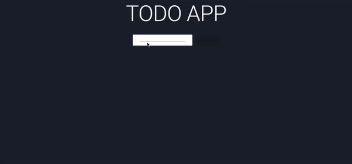

Simple ToDo Web Application.

FrontEnd: ReactJS and Material UI
BackEnd: Google Firebase

A simple responsive React JS WebApplication to manage your tasks, and Google Firebase to manage to the data and server.
Create, Read and Delete functionality.

To run on your system, follow these steps:

 1. Clone/Download the repository
 2. Make sure you have latest version of NodeJS installed.
 3. In your terminal, open the folder and run the command `npm i`.   
 4. This will install all the neccesary Node Modules required.
 5. Run the command `npm start`, and the application will start on your localhost. 
